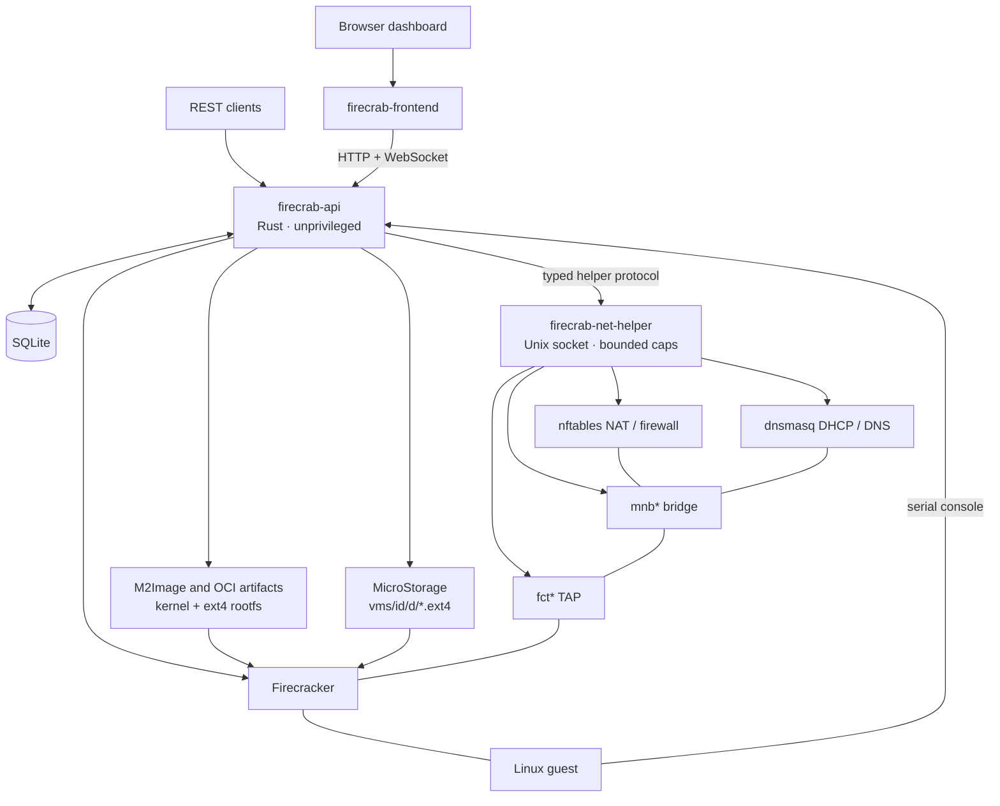
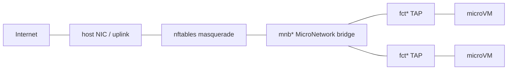
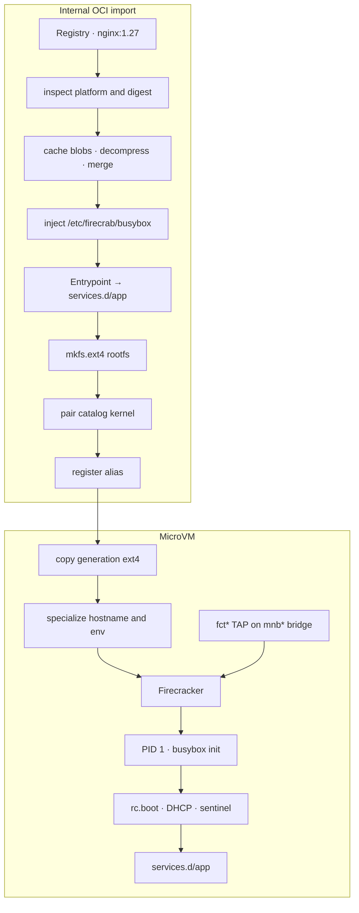

<p align="center">
  <a href="https://www.rust-lang.org"></a>
  <a href="https://codecov.io/gh/SteelCrab/firecrab"></a>
  <a href="https://www.linux.org"></a>
  <a href="./LICENSE"></a>
  <a href="./CHANGELOG.md"></a>
</p>

```text
███████ ██ ██████  ███████  ██████ ██████   █████  ██████
██      ██ ██   ██ ██      ██      ██   ██ ██   ██ ██   ██
█████   ██ ██████  █████   ██      ██████  ███████ ██████
██      ██ ██   ██ ██      ██      ██   ██ ██   ██ ██   ██
██      ██ ██   ██ ███████  ██████ ██   ██ ██   ██ ██████
```

<p align="center">A lightweight microVM platform for your own server.</p>

<p align="center">
  <a href="./README.ko.md">한국어</a> ·
  <a href="./README.zh.md">中文</a> ·
  <a href="./README.ja.md">日本語</a>
</p>

firecrab runs and manages isolated [Firecracker](https://firecracker-microvm.github.io/)
microVMs on a Linux host you control. It combines a Rust API, a browser dashboard,
and two small system services so that creating a VM also means choosing its image,
network, disk location, and outbound-access policy.

It is intended for a private, single-host microVM environment: a practical way to
operate workloads that need stronger isolation than containers without introducing a
full cloud control plane. It is not a hosted service or a multi-host scheduler.

## Core capabilities

- **Run microVMs:** create, inspect, edit inactive VMs, start, stop, delete, and use
  each VM's browser-based serial console.
- **Choose an isolated network:** create explicit **MicroNetworks**; each VM belongs
  to one network and receives a persistent IPv4, MAC, and hostname. Networks are
  isolated from one another, with per-VM internet or isolated egress.
- **Manage images and disks:** install M2Image templates, import an OCI image from a
  registry, bootstrap supported distributions in a temporary builder VM, and place
  VM disks on configured storage roots or registered **MicroStorage** pools.
- **See what is happening:** inspect startup progress, console logs, and host status
  in the dashboard, available in English and Korean.
- **Keep host privileges small:** the API runs unprivileged; the separate
  `firecrab-net-helper` owns only the capabilities needed for host networking.

## Platform comparison

| Category | **Firecrab** | VMware / ESXi | KVM + libvirt | OpenStack | Firecracker alone |
| --- | --- | --- | --- | --- | --- |
| Basic unit | **microVM** | VM | VM | VM | microVM |
| Virtualization | Firecracker + KVM | VMware hypervisor | KVM/QEMU | Mainly KVM/QEMU | KVM |
| Main goal | **Simple microVM operation on one server** | Enterprise virtualization | General-purpose Linux virtualization | Large private cloud | Run microVMs |
| Management complexity | **Designed to be low** | Medium | Medium–high | **Very high** | High |
| Web dashboard | ✅ | ✅ | Separate setup | ✅ | ❌ |
| VM images | **M2Image** | Template/Image | qcow2, etc. | Glance | Manual |
| Virtual network | **MicroNetwork** | vSwitch | bridge/libvirt network | Neutron | Manual implementation |
| Disk management | **MicroStorage** | Datastore/VMDK | qcow2/LVM, etc. | Cinder | Manual implementation |
| Browser console | ✅ | ✅ | Setup required | ✅ | ❌ |
| VM isolation | **Strong** | Strong | Strong | Strong | **Strong** |
| Boot speed | **Very fast** | Relatively slow | Relatively slow | Relatively slow | **Very fast** |
| Resource overhead | **Low** | High | Medium | High | **Very low** |
| Control plane | **Minimal** | Included | Almost none | **Large-scale** | None |
| Single-server operation | **Primary goal** | Supported | Supported | Inefficient | Supported |
| Cluster / HA | Limited / future extension | ✅ | Separate setup | ✅ | ❌ |
| Kubernetes integration | Possible future runtime | Supported | Supported | Supported | containerd integration available |
| Best fit | **Personal server, homelab, edge, development server** | Enterprise datacenter | Linux server | Large cloud | Serverless/container infrastructure |

## Architecture

One Linux host. One unprivileged API. One capability-bounded helper.
One Firecracker process per running guest. No multi-host scheduler.



A MicroNetwork is one IPv4 subnet on its own bridge.
Same-network guests talk on that bridge.
Different networks are blocked.
Internet NAT needs both the network `internetEnabled` switch and the VM
`egressPolicy`.



An imported OCI image is not a bootable OS. The internal pipeline
turns a registry tree into a Firecracker rootfs, then a MicroVM start
boots busybox as PID 1 and runs the image entrypoint as a service.



`/proc/1/exe` is `/etc/firecrab/busybox`. The image entrypoint is never PID 1.
`ls -l /sbin/init` may still show the image `systemd` symlink.
See [OCI images](public-docs/oci.md) and [API](public-docs/api.md).

| Piece | Job |
| --- | --- |
| `firecrab-frontend` | VM, network, image, storage, and console UI |
| `firecrab-api` | REST, WebSocket, lifecycle, SQLite, artifact checks |
| `firecrab-net-helper` | Bridge, TAP, DHCP, DNS, NAT, firewall, port forwards |
| Firecracker | One process per running guest |
| SQLite | Durable VMs, networks, leases, port forwards |
| M2Image / OCI | Verified kernel + rootfs; OCI imports get a busybox PID 1 |
| MicroStorage | Host directory for VM disks |

The installed API serves the built dashboard.
Development uses Vite and proxies `/api` and `/ws` to the API.
See the detailed [architecture](public-docs/architecture.md).

## Install on a Linux host

Requirements are a Linux host with `/dev/kvm`, network access, and a user allowed to
run `sudo`. Run the installer as that regular user — do **not** prefix the script with
`sudo`. It downloads release binaries and uses `sudo` only for the individual package,
systemd, and host-setup operations that need it.

```sh
curl -fsSL https://github.com/SteelCrab/firecrab/releases/latest/download/install.sh | bash
```

Useful installer modes:

```sh
./install.sh --check                 # report prerequisites and planned changes
./install.sh --doctor                # diagnose KVM, firewall, socket, and host setup
./install.sh --bin-dir target/release
./install.sh --uninstall         # retain data by default
./install.sh --uninstall --purge # also remove /var/lib/firecrab
```

The default install downloads the host bundle for this architecture and libc
(`gnu` / glibc, or `musl`) and does not install a guest image.
Pass `--libc gnu` or `--libc musl` to pick one.
KVM cannot be enabled by the script: if `/dev/kvm` is absent, enable hardware
virtualization (or nested virtualization) first. For every option, install path,
upgrade detail, and troubleshooting step, read the [installation guide](public-docs/installation.md).

## Quick start

Open `http://127.0.0.1:5523/` after installation, then:

1. Create a **MicroNetwork**.
2. Choose an installed image and create a VM in that network.
3. Start the VM, wait for it to become `running`, then open **Terminal**.

Creating the network first is intentional: firecrab has no hidden default subnet, so
every VM is placed in a network chosen by the operator.

## Dashboard walkthrough


The dashboard separates day-to-day operation into **MicroVM**, a per-VM
**Terminal**, **Networks**, and **Images** in the left navigation.

### MicroVM

The form creates a VM from its name, image, CPU, RAM, disk, storage location,
MicroNetwork, and egress policy. The list below refreshes state, image, resources, and
ID every three seconds; running VMs expose **Terminal** and **stop** actions. Select a
VM name for startup progress, logs, network, storage, and other details.


### Terminal

**Terminal** opens a running VM's browser serial console in a separate tab. It streams
boot output and the login prompt in real time and accepts commands. The toolbar lets
you adjust display settings, copy or save console logs, and switch to a
terminal-only view; the lower panels show the VM's general information, specs,
network, and storage.


### Networks

Create a **MicroNetwork** with its name, subnet CIDR, and internet policy. The list
shows each network's gateway, internet state, and ID. Use **Block internet** or
**Enable internet** to change NAT-backed outbound access for the whole network, or
delete it. Selecting a row reveals subnet address use, bridge/TAP, NAT, firewall, and
member VM details.


### Images

The **M2Image** list shows each image's size and state, such as `Package ready` or
`Installed`. Select a row to inspect its alias, version, minimum disk, rootfs size,
state, and the VMs that use it. The `…` menu offers state-appropriate package install,
bootstrap, or delete actions. Only installed images can be used to create VMs.

The same screen can inspect an OCI reference (`nginx:1.27`) for this host's
architecture and import it as a registered template. Import is a background job;
the page shows progress, errors, and the registered alias when it finishes.


For API request formats, lifecycle semantics, and error envelopes, see the
[API guide](public-docs/api.md). For image packages and browser-driven bootstrap,
see the [image guide](public-docs/images.md). For OCI inspect and import, see the
[OCI image guide](public-docs/oci.md).

## Develop from source

Use three terminals: the network helper, API, and Vite dashboard. Run the API from
the repository root because its local data paths are relative to the working directory.

```sh
# Terminal 1 — privileged network operations
cargo build -p firecrab-net-helper
sudo -u root -g "$(id -gn)" FIRECRAB_NET_HELPER_ALLOWED_UID="$(id -u)" \
  ./target/debug/firecrab-net-helper

# Terminal 2 — API and Firecracker manager
# Optional: stop a previous API binary only (ignore if none)
pkill -x firecrab-api 2>/dev/null || true
cargo run -p firecrab-api

# Terminal 3 — dashboard at http://localhost:8080/
# Optional: stop a previous Vite from this checkout (ignore if none)
pkill -f '[f]irecrab-frontend/node_modules/.bin/vite' 2>/dev/null || true
npm install --prefix firecrab-frontend
npm run dev --prefix firecrab-frontend
```

For a production-like local run, build the dashboard and let the API serve it:

```sh
npm run build --prefix firecrab-frontend
FIRECRAB_STATIC_ROOT="$PWD/firecrab-frontend/dist" cargo run -p firecrab-api
# http://127.0.0.1:5523/
```

Run the Rust test suite with:

```sh
cargo test --workspace
```

Browser E2E for OCI inspect → import (local registry fixture, no Docker Hub):

```sh
npm install --prefix firecrab-e2e
npm run install-browsers --prefix firecrab-e2e
FIRECRAB_E2E_SKIP_GUEST_BOOT=1 npm test --prefix firecrab-e2e
```

That command expects 1 passed and 1 skipped.
The skipped test creates and boots a VM; run `npm test --prefix firecrab-e2e` without the flag on a KVM host with Firecracker and `./scripts/dev-net-helper.sh`.
See [firecrab-e2e/README.md](firecrab-e2e/README.md).

More development notes and browser workflow details are in the [web dashboard guide](public-docs/dashboard.md).

## Documentation

The English technical documentation in [`public-docs/`](public-docs/README.md) covers architecture,
installation, operations, API contracts, and troubleshooting.

## Contributing

<p align="center">
  <a href="./CONTRIBUTING.md">
    
  </a>
</p>

See [CONTRIBUTING.md](./CONTRIBUTING.md) for the [maintainer’s note](./CONTRIBUTING.md#a-note-from-the-maintainer),
development setup, checks, pull request expectations, and documentation rules.

## License

Licensed under the [Apache License, Version 2.0](./LICENSE).
