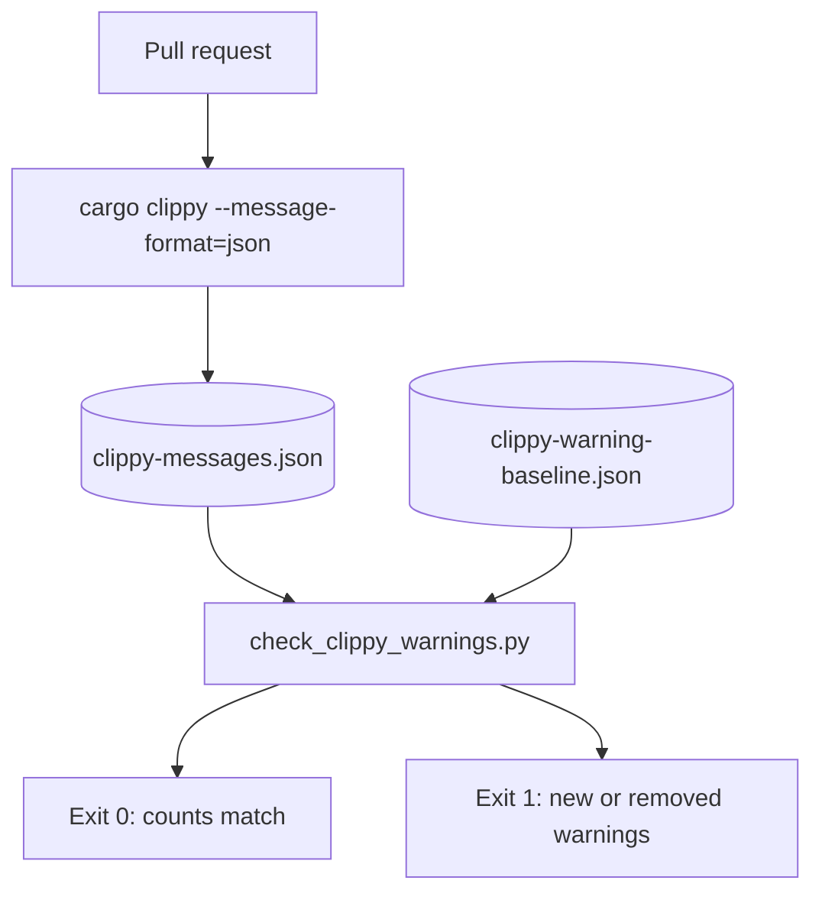

# Clippy warning gate

A pull request workflow runs Clippy and compares warning counts to a checked-in baseline.

- Runs on every pull request.
- Compares Clippy warning counts to the checked-in baseline.
- Fails on a new warning.
- Fails on a stale baseline: a warning was fixed but the baseline was not updated.



```sh
cargo clippy --workspace --all-targets --message-format=json > clippy-messages.json
python3 scripts/check_clippy_warnings.py clippy-messages.json .github/clippy-warning-baseline.json
```

- Refresh the baseline after an intentional change in warning counts.

```sh
python3 scripts/check_clippy_warnings.py clippy-messages.json .github/clippy-warning-baseline.json --write-baseline
```

## Related

- [Operations](operations.md)
- [Troubleshooting](troubleshooting.md)
