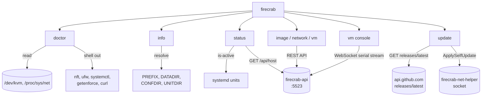

# firecrab CLI

`firecrab` is a host command-line client for the same loopback REST API the dashboard uses.
It diagnoses host readiness, prints resolved configuration, reports live status, and manages images,
MicroNetworks, and VM lifecycles without a browser.

## Contents

| Section | Content |
| --- | --- |
| [Architecture](#architecture) | What each subcommand talks to |
| [doctor](#doctor) | The 13 host-readiness checks |
| [info](#info) | Version and resolved paths |
| [status](#status) | Live systemd and API state |
| [Host API commands](#host-api-commands) | Image, MicroNetwork, and VM operations |
| [update](#update) | Release check and in-place upgrade |
| [Develop](#develop) | Running the CLI from a checkout, no install |
| [Related](#related) | Other documents |

## Architecture

Each subcommand is independent: `doctor` reads the host directly, `info` reads only local configuration,
and `status`, `image`, `network`, and `vm` call `firecrab-api`.
The resource commands never talk to Firecracker, nftables, or `firecrab-net-helper` directly — the CLI
is a client, not a second control plane.



| Subcommand | Talks to | Needs root |
| --- | --- | --- |
| `doctor` | `/proc`, `/dev/kvm`, and external tools (`nft`, `ufw`, `systemctl`, `getenforce`, `curl`) | No — privileged checks degrade to SKIP with a fix hint |
| `info` | Only environment variables and install defaults | No |
| `status` | `systemctl is-active` and `GET /api/host` | No |
| `image`, `network`, and VM lifecycle commands | The corresponding `firecrab-api` REST resources | No |
| `vm console` | The running VM's serial-console WebSocket | No |
| `update` | `api.github.com`, the release asset host, and the net-helper socket | `--check` no; `--apply` yes (root or the `firecrab` account) |

## doctor

Runs 13 checks in a fixed order and prints one summary line, then a `[FAIL]`/`[SKIP]` block per problem; a passing check is silent.

| Check | Verifies |
| --- | --- |
| `kvm` | `/dev/kvm` exists and the current user can read and write it |
| `firecracker` | the `firecracker` binary runs and reports a version |
| `ip_forward` | `net.ipv4.ip_forward` is `1` |
| `nft` | the `inet firecrab` and `bridge firecrab_l2` tables exist |
| `dnsmasq` | a firecrab `dnsmasq` process is alive and serving every bridge |
| `helper_socket` | the net-helper socket exists and the API account can reach it |
| `ufw` | UFW, if active, allows DHCP, DNS, and forwarding on every firecrab bridge |
| `data_root` | exactly one `firecrab.db` is reachable from `DATADIR` or the working directory |
| `images` | the default template artifacts exist under an image root |
| `image_install_tools` | `tar` and `zstd` are installed for dashboard template installs |
| `selinux_domain` | no firecrab service is confined to systemd's own `init_t` domain |
| `registry_egress` | the API account can reach the image registry |
| `reflink` | the image root and VM disk roots share one filesystem |

```sh
firecrab doctor
firecrab doctor --json
firecrab doctor --digest   # also prints a short sha256 per template artifact
```

- Exit code is non-zero if any check FAILed, `0` if the rest is PASS or SKIP only — scripts and CI can depend on this.
- Reads `DATADIR`, `FIRECRAB_API_USER`, `FIRECRAB_NET_HELPER_SOCK`, `FIRECRAB_DNSMASQ_CONF`, `FIRECRAB_DNSMASQ_PID`, `FIRECRAB_LIBDIR`, `FIRECRAB_IMAGE_ROOT`, `FIRECRAB_IMAGE_BASE_URL`, `FIRECRAB_STORAGE_ROOTS`, `FIRECRAB_FIRECRACKER_BIN`, `CONFDIR` — see [Installation](installation.md) for their install-time defaults.
- Ported from the retired `scripts/firecrab-doctor.sh`; every check keeps its original PASS/FAIL/SKIP condition.

## info

Prints the CLI's version and the host configuration paths it resolves — a quick sanity check that an install's environment matches what a script or unit expects.

```sh
firecrab info
firecrab info --json
```

- Fields: `version`, `prefix`, `datadir`, `confdir`, `unitdir`, `apiBase`.
- Path defaults mirror `install.sh`: `PREFIX=/usr/local`, `DATADIR=/var/lib/firecrab`, `CONFDIR=/etc/firecrab`, `UNITDIR=/etc/systemd/system`, each overridable by the same-named environment variable.
- `apiBase` resolves `--api`, then `FIRECRAB_API`, then `http://127.0.0.1:5523`.

## status

Reports the two host services and the live API in one call, and stays useful when the API is down: a dead or erroring API still lets the systemd lines print.

```sh
firecrab status
firecrab status --json
firecrab status --api http://127.0.0.1:5523
```

- `firecrab-api.service` / `firecrab-net-helper.service`: `systemctl is-active`, or `unknown` if `systemctl` itself cannot run.
- `host`: `GET /api/host` — load average, memory, disk, and uptime — or `null` with `hostError` set if the API is unreachable or answers an error.
- Base URL resolution is the same as `info`: `--api`, then `FIRECRAB_API`, then `http://127.0.0.1:5523`.

## Host API commands

The resource commands use the same validation and lifecycle rules as the dashboard because every
operation goes through `firecrab-api`.

| Command | API operation |
| --- | --- |
| `firecrab image list [--json]` | `GET /api/images` |
| `firecrab image inspect REFERENCE [--json]` | `GET /api/oci/inspect?reference=...` |
| `firecrab image import REFERENCE [--json]` | `POST /api/oci/import` |
| `firecrab image import-status ALIAS [--json]` | `GET /api/oci/import/{alias}` |
| `firecrab network list [--json]` | `GET /api/micro-networks` |
| `firecrab network create --name NAME --subnet-cidr CIDR [--json]` | `POST /api/micro-networks` |
| `firecrab network delete ID [--json]` | `DELETE /api/micro-networks/{id}` |
| `firecrab vm list [--json]` | `GET /api/vms` |
| `firecrab vm create --name NAME --template ALIAS --network UUID [--cpu N] [--ram MIB] [--disk-gb GIB] [--egress internet\|isolated] [--storage-root ID] [--json]` | `POST /api/vms` |
| `firecrab vm start ID [--json]` | `POST /api/vms/{id}/start` |
| `firecrab vm stop ID [--json]` | `POST /api/vms/{id}/stop` |
| `firecrab vm delete ID [--json]` | `DELETE /api/vms/{id}` |
| `firecrab vm console ID` (`terminal` alias) | `GET /ws/vms/{id}/console` WebSocket upgrade |

`vm create` defaults to one vCPU, 512 MiB RAM, and a 2 GiB disk. Override them with `--cpu N`,
`--ram MIB`, and `--disk-gb GIB`. `--egress internet|isolated` selects the VM's outbound posture,
and `--storage-root ID` selects a registered storage root. Pass `--json` to any resource command for
machine-readable output.

Attach to a running VM's serial console without a browser:

```sh
firecrab vm console VM_ID
# Equivalent discoverable alias:
firecrab vm terminal VM_ID
```

The initial stream includes up to 256 KiB of boot backlog, followed by live ttyS0 output. The CLI
puts a local TTY in raw mode, so Ctrl+C and other control bytes reach the guest. Type Ctrl+] to
detach without stopping the VM. Terminal settings are restored on normal exit, VM shutdown, and
connection errors. An `http://` API base maps to `ws://`; `https://` maps to `wss://`. If the VM is
not running, the command exits `1` and preserves the API's HTTP status and JSON error body.

OCI import runs in the API background. Inspect first to confirm the host architecture and derived
alias, start the import, then poll that alias until it succeeds:

```sh
firecrab image inspect nginx:1.27
firecrab image import nginx:1.27
firecrab image import-status nginx-1.27
```

`import` exits after the API accepts the job and prints the alias to poll. `import-status` exits `1`
when the job has failed and includes the last non-empty log line in the error. See
[OCI images](oci.md) for pipeline and registry authentication details.

Create the dependencies in image → network → VM order:

```sh
firecrab image list
firecrab network create --name app --subnet-cidr 172.31.20.0/24
# Copy the network id from the result.
firecrab vm create \
  --name app-1 \
  --template alpine-3.24.1 \
  --network NETWORK_ID
```

The API base resolves in this order: global `--api URL`, `FIRECRAB_API`, then
`http://127.0.0.1:5523`. The global flag may appear before or after a subcommand:

```sh
firecrab --api http://127.0.0.1:5523 vm list
firecrab vm list --api http://127.0.0.1:5523
```

A successful resource command exits `0`. An unreachable API or an API error exits `1`; for a
non-success HTTP response, the CLI prints both the HTTP status and the API response body so validation
fields and request IDs remain visible.

## update

Compares this build's version with the newest GitHub Release tag, and optionally installs it.

```sh
firecrab update --check
firecrab update --check --json
sudo firecrab update --apply
```

With no flag, `update` behaves as `--check`.

| Flag | Effect |
| --- | --- |
| `--check` | Report only; no download. Exit 0 whether or not an update exists, 1 if the check itself failed |
| `--apply` | Download the host bundle, verify SHA-256, and hand the swap to `firecrab-net-helper` |
| `--json` | Emit `UpdateCheckResponse`, the same body `GET /api/update` returns |

`--json` prints a report even when the check fails, with `latest` absent and `error` filled in.

The CLI never writes to the install directories and never calls `systemctl`.
It stages the bundle under `$DATADIR/updates/<uuid>` and sends one request to the helper, which re-verifies the checksum from its own open file descriptor before replacing anything.
Unit files are not updated by `--apply`; see [Operations](operations.md#upgrade).

| Variable | Default | Job |
| --- | --- | --- |
| `FIRECRAB_RELEASE_REPO` | `SteelCrab/firecrab` | Repository the release comes from |
| `FIRECRAB_RELEASE_API` | GitHub `releases/latest` | Version-check endpoint |
| `FIRECRAB_RELEASE_BASE` | GitHub releases root | Asset download root |
| `FIRECRAB_LIBC` | This build's target | `gnu` or `musl` bundle selection |

## Develop

No install needed — run the built binary straight from the workspace target directory.

```sh
# Terminal 1 — build once, or after every change
cargo build -p firecrab-cli

# Terminal 2 — doctor/info read this host directly, no API needed
./target/debug/firecrab doctor
./target/debug/firecrab info

# status and resource commands need a running API — point them at a dev instance
# (see "Develop from source" in CONTRIBUTING.md for Terminals 1-3 of firecrab-api itself)
./target/debug/firecrab status --api http://127.0.0.1:5523
./target/debug/firecrab image list --api http://127.0.0.1:5523
```

- `cargo run -p firecrab-cli -- doctor` works too; `cargo build` first is only for repeat runs without a rebuild each time.
- Unit tests (`FakeCommandRunner`, no real host state touched): `cargo test -p firecrab-cli`.
- `doctor`'s checks always read the real host it runs on — there is no way to point them at another machine or a fixture host.
- More on running `firecrab-api`/`firecrab-net-helper`/the dashboard together: [CONTRIBUTING.md](../CONTRIBUTING.md#develop-from-source).

## Related

- [Installation](installation.md)
- [Operations](operations.md)
- [Troubleshooting](troubleshooting.md)
- [Storage](storage.md)
