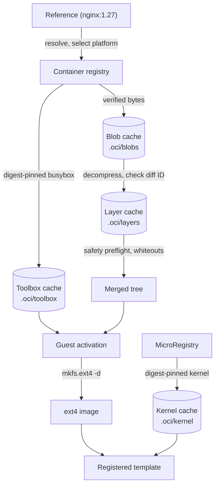

# OCI images

firecrab can inspect a container image and import it as a bootable template.
The pipeline caches layers, merges them, injects a guest runtime, writes ext4, pairs a kernel, and registers an alias.

## Contents

| Section | Content |
| --- | --- |
| [Architecture](#architecture) | The stages an import runs through |
| [Inspect](#inspect) | Ask whether an image can run here |
| [Import](#import) | Start and poll the background job |
| [Blob cache](#blob-cache) | Verified registry bytes on disk |
| [Layer decompression](#layer-decompression) | Compressed stream to verified tar |
| [Layer safety preflight](#layer-safety-preflight) | Tar rules checked before extraction |
| [Layer merge](#layer-merge) | Manifest order, whiteouts, atomic publish |
| [Guest toolbox](#guest-toolbox) | The static program the guest boots as PID 1 |
| [Guest activation](#guest-activation) | Init, boot script, console, metrics |
| [Ext4 image](#ext4-image) | Sizing and publishing the rootfs |
| [Kernel](#kernel) | The published kernel and its cache |
| [Name and register](#name-and-register) | Alias rules and the local template |
| [Service](#service) | The image entrypoint as a service |
| [Related](#related) | Other documents |

## Architecture

An import is a chain of stages. Each one verifies its input, publishes its output atomically, and hands a typed value to the next; nothing is registered until the last one succeeds.



| Stage | Input | Output | Cached at |
| --- | --- | --- | --- |
| Resolve | Reference | Manifest digest, architecture | — |
| Blob cache | Manifest | Verified config and layer bytes | `.oci/blobs/sha256/` |
| Decompress | Layer blob | Verified uncompressed tar | `.oci/layers/sha256/` |
| Preflight | Tar | The same tar, proven safe | — |
| Merge | Tars in manifest order | Staging tree | — |
| Toolbox | busybox image | Static program | `.oci/toolbox/` |
| Activate | Staging tree | Bootable tree with init | — |
| Ext4 | Bootable tree | Packed image | — |
| Kernel | MicroRegistry package | Kernel image | `.oci/kernel/<arch>/` |
| Register | ext4 + kernel | `TemplateSpec` under an alias | `rootfs/<alias>.ext4` |

- Caches are content-addressed and re-verified on reuse, so a repeated import contacts the network only for what it does not already hold.
- Every cache lives under `<FIRECRAB_IMAGE_ROOT>/.oci/`; a partial write never lands at a final path.
- The kernel is the only stage that reads the MicroRegistry rather than the container registry.

## Inspect

- Answers whether an image can run here, without downloading its config or layers.
- Reference is written as at `docker pull`; a bare name is Docker Hub `library` at `latest`.
- Answer is the manifest digest this host would pull, plus the alias a later import claims.
- A missing architecture is rejected (OCI uses Go's names, so x86_64 is `amd64`).
- HTTPS only, except `localhost` and `127.0.0.1`.

```sh
curl -s 'http://127.0.0.1:5523/api/oci/inspect?reference=nginx:1.27'
firecrab image inspect nginx:1.27
```

- Docker Hub's anonymous quota is per source address, so a shared egress IP answers `429`.
- Save an account with `PUT /api/microregistry/docker-hub` — see [API](api.md) — and inspect, import, and the toolbox pull all use it.
- `Permission denied (os error 13)` is this host refusing the socket, not a login problem — see [Troubleshooting](troubleshooting.md).

## Import

- Import is a background job, because REST requests time out at 10 seconds.
- Poll `GET /api/oci/import/{alias}` for the `ImageInstallResponse` package install uses.
- Success adds the alias to `GET /api/images`.

```sh
curl -s -X POST http://127.0.0.1:5523/api/oci/import \
  -H 'Content-Type: application/json' \
  -d '{"reference":"nginx:1.27"}'

firecrab image import nginx:1.27
firecrab image import-status nginx-1.27
```

- `firecrab image import` returns after the API accepts the background job.
- `firecrab image import-status <alias>` prints the current snapshot; `--json` preserves the API shape.
- A failed snapshot exits `1` and reports the last non-empty import log line.

| Failure | Answer |
| --- | --- |
| Bad reference | `400 validation_failed` |
| Catalog or installed alias | `409 alias_collision` |
| Job already running | `409 import_in_progress` |

## Blob cache

- Configs and layers are cached by SHA-256 at `<FIRECRAB_IMAGE_ROOT>/.oci/blobs/sha256/<hex>`.
- Entries hold the raw registry bytes, never decompressed data.
- Every lookup verifies size and digest; a corrupt entry is discarded and fetched again.
- One download is limited to 16 GiB (`FIRECRAB_OCI_MAX_BLOB_BYTES`).

## Layer decompression

- Plain, gzip, and zstd streams are decoded to `.oci/layers/sha256/<diff-id>/<compressed-digest>.<codec>.tar`.
- The manifest descriptor digest covers the registry bytes; the config `rootfs.diff_ids` entry covers the uncompressed tar.
- A tar is published only after its diff ID matches.
- Cache hits are rehashed; a corrupt entry is rebuilt from the verified blob.
- Output is limited to 64 GiB per layer (`FIRECRAB_OCI_MAX_UNCOMPRESSED_LAYER_BYTES`).
- At most two decoders run process-wide, each zstd window 128 MiB.

## Layer safety preflight

Every decompressed tar is scanned before extraction, reading GNU long-name/link metadata and PAX overrides.

- Member names are relative and free of parent components; only a directory may name the root as `.` or `./`.
- Character devices, block devices, and FIFOs are skipped; other special entries are rejected.
- Links must name a target; hard-link targets stay archive-root-relative.
- Regular whiteout files stay valid for the merge stage.

Rejected outright, stopping the import:

- Malformed headers, repeated PAX path/link records, sparse extensions.
- Missing end records and truncated member bodies.
- PAX `size` overrides, and global PAX path/link/size overrides.
- Any GNU or PAX metadata entry over 1 MiB.

Rejection keeps the verified blob and decompressed tar as cache entries.

## Layer merge

- Validated tars are consumed in manifest order.
- Each stream is reopened without following a cache-path symlink, then rechecked for size, `diff_id`, and archive safety.
- The staging tree keeps ordinary and sticky permissions, owned by the unprivileged API service.
- Image set-ID bits, numeric ownership, and extended attributes are not applied here; they belong to the ext4 stage.
- `.wh.<name>` removes the named sibling from lower layers; `.wh..wh..opq` removes lower-layer children of its directory.
- Whiteouts are applied before that layer's ordinary members, so a same-layer replacement survives and markers never appear.
- The tree is built as a private sibling and published atomically; the destination must not already exist.
- A failure removes the partial tree and retains verified blob and layer cache entries.

## Guest toolbox

A container image is an application, not an operating system: no PID 1, no DHCP client, nothing that reports readiness.
One static program supplies all three before a merged tree can boot.

- Taken from a digest-pinned busybox image, pulled through the same verified stages as the image being imported.
- Must be a 64-bit executable for this host with no dynamic loader recorded, because the merged tree has none to satisfy.
- Cached at `<FIRECRAB_IMAGE_ROOT>/.oci/toolbox/`, re-verified on every reuse, rebuilt when it no longer passes.
- `FIRECRAB_OCI_TOOLBOX_IMAGE` names a mirror; `FIRECRAB_OCI_TOOLBOX_PATH` names a program already on the host.

## Guest activation

- Installs an init at `/sbin/init` and the toolbox at `/etc/firecrab/busybox` (basename `busybox`, so the multiplexer runs).
- The image then boots on the same kernel command line every other template uses.
- The boot script mounts `/proc`, `/sys`, `/dev` (with `/dev/fd`), and `/run`.
- The interface comes up before the lease is asked for; the result is `FIRECRAB_NETWORK_READY` with the address or `FIRECRAB_NETWORK_FAILED` with a reason.
- The metrics agent reporting guest CPU and memory is started.
- Missing PATH tools (`ping`, `wget`, `vi`, `nc`) become busybox symlinks.
- After DHCP, the first boot installs a small set through apt/dnf/apk/zypper/pacman and stamps `/etc/firecrab/base-packages.ok`.
- With util-linux `agetty` and bash, the serial console is `ttyS0 → agetty → login → bash`; otherwise the wrapper prints MOTD and drops into ash.
- With a glibc loader, a digest-pinned official fastfetch (polyfilled, GLIBC_2.17) is copied to `/usr/bin/fastfetch`, cached at `<FIRECRAB_IMAGE_ROOT>/.oci/fastfetch/`.
- `FIRECRAB_OCI_FASTFETCH_PATH` names a host binary; a missing program is not an import failure.
- `/etc/firecrab/services.d` is created empty for the image entrypoint, which a later stage runs as a service rather than PID 1.
- `/etc/firecrab/services.d/sshd` starts `sshd` with key-only root login after first-boot packages install `openssh-server` (or `openssh` on apk). Distroless images without a binary skip it.
- Images that place `/sbin` or `/etc` behind a symbolic link are activated through it.
- Resolution is clamped to the tree; an entry already occupying a guest path is replaced without writing through it.
- A failed activation restores every path it touched.

## Ext4 image

- The image is sized from the provisioned tree, not from a fixed length.
- Payload counts each regular inode once and includes symlink targets; hard links are not counted again.
- Size is payload plus a quarter for metadata plus 32 MiB headroom, rounded up to a mebibyte, never below 8 MiB.
- One image is limited to 32 GiB (`FIRECRAB_OCI_MAX_ROOTFS_BYTES`).
- Created sparse, formatted with `mkfs.ext4 -d`, published only after `tune2fs` shows free space remains.
- A full image, a failed format, or an existing destination is an error; the partial file is removed and the tree left in place.
- This stage pairs no kernel and registers nothing.

## Kernel

The packed ext4 is paired with the kernel firecrab publishes for this architecture, so no catalog image has to be installed first.

- `virtio_blk`, `virtio_net`, `virtio_mmio`, and `ext4` are built in, and there is no initrd.
- The current release pins Linux `7.2.2` for both `x86_64` and `aarch64`; `7.1.9` remains in the kernel-management catalog for rollback.
- Each entry has architecture-specific package and image digests.
- Pinned by digest, fetched once from `FIRECRAB_IMAGE_BASE_URL`, cached at `<FIRECRAB_IMAGE_ROOT>/.oci/kernel/<arch>/`.
- Re-verified on every reuse; a failed entry is refetched.
- `FIRECRAB_OCI_KERNEL_PATH` names a host copy, which must match the same digest.
- A host that cannot reach the registry falls back to an installed catalog kernel.
- The dashboard's Kernels page uses the same cache; install a version there before pairing it with an image from the image detail panel.

## Name and register

- The alias is the repository and tag — `nginx:1.27` becomes `nginx-1.27`.
- A catalog or installed alias is refused.
- The ext4 is copied to `rootfs/<alias>.ext4`.
- The result is a local template, not a MicroRegistry row; register it as in [Images](images.md) and [API](api.md).

## Service

- Entrypoint, Cmd, Env, and WorkingDir become `/etc/firecrab/services.d/app`.
- The injected init starts it after the sentinel. It is never PID 1.
- On start, a `# >>> firecrab vm env` block sources `/etc/firecrab/vm.env`; guest paths are in [API](api.md).
- Create writes an operator ed25519 pair under `{vms}/{id}/ssh/`. Start injects the public key into `/root/.ssh/authorized_keys` and a per-VM host key into `/etc/ssh/`.
- Dashboard VM detail downloads `firecrab-<name>.pem`. The serial console SSH tab copies `ssh -i … root@<ipv4>` and `-6` for IPv6.

## Related

- [Images](images.md)
- [Dashboard](dashboard.md)
- [API](api.md)
- [Storage](storage.md)
